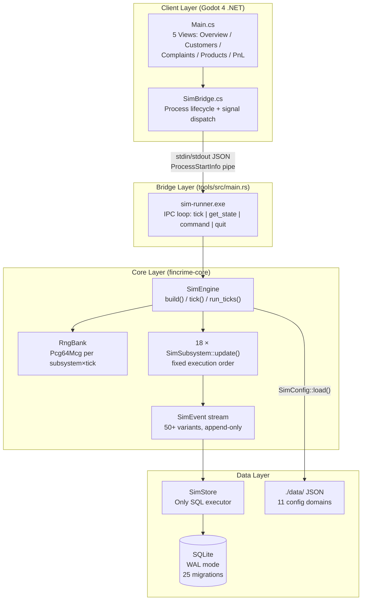
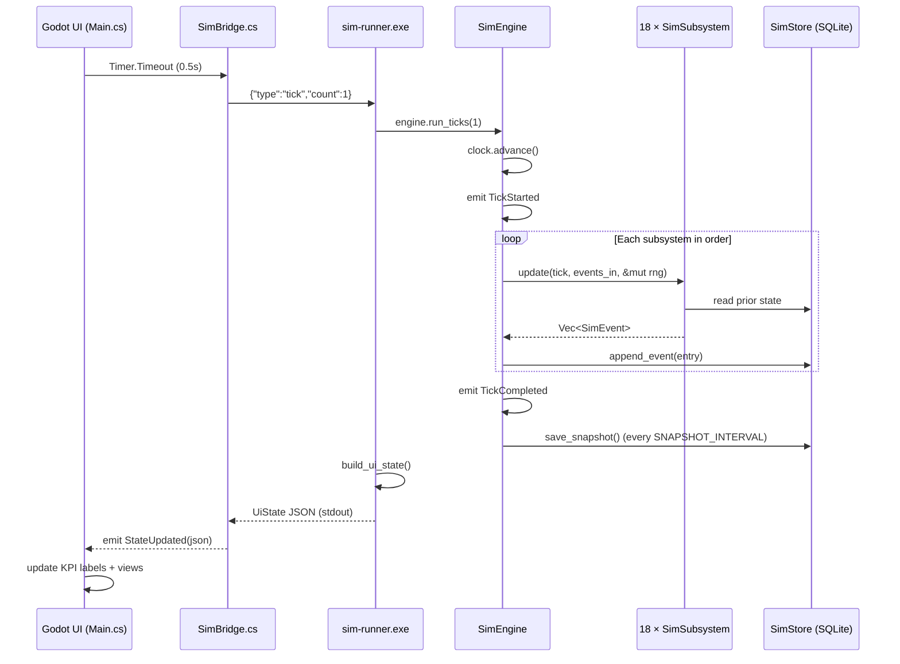

# Architecture — FinCrime: The Desk

## Core Concepts

### Tick Model (ADR-001)

One tick equals one in-game day. Time is a `u64` counter (`Tick`), never a real-world timestamp. All scheduled events (SLA deadlines, SAR filing windows, regulatory exam dates) are expressed as tick offsets. Fast-forward runs multiple ticks per real-world frame; the engine has no concept of wall-clock time.

The engine refuses to `tick()` when paused:

```rust
assert!(!self.clock.paused, "tick() called on paused engine");
```

### Determinism (ADR-003)

All simulation randomness flows through `SubsystemRng` instances, which are `Pcg64Mcg` generators seeded as:

```
derived_seed = master_seed XOR (subsystem_index × 0x9e3779b97f4a7c15)
```

Per-tick seeding adds a second XOR layer: `tick_seed = master_seed XOR (tick × 0x517cc1b727220a95)`. Platform RNGs (`thread_rng`, `SystemTime`, `Instant::now`) are **forbidden** in `/core` and enforced by the CI lint step. Subsystem slots are append-only integers — reordering is forbidden because it would change every subsystem's random stream.

### Events / Commands

Subsystems communicate **only** through events. No subsystem calls another subsystem's functions directly (enforced by code review and ADR-004). The `SimEvent` enum (50+ variants in `event.rs`) is the complete inter-subsystem protocol.

Player actions enter via `PlayerCommand` (6 variants in `command.rs`): `Pause`, `Resume`, `SetSpeed`, `CloseComplaint`, `SetProductFee`, `SetRiskDial`. Commands are queued via `SimEngine::submit_command()` and injected into the next tick's event stream.

### Snapshots

The engine calls `take_snapshot()` at every `SNAPSHOT_INTERVAL` ticks. Snapshots persist the `SimClock` state as JSON via `SimStore::save_snapshot()` and serve as restore points.

### Persistence (ADR-002)

SQLite in WAL mode provides concurrent reads from the UI thread while the simulation thread writes. `SimStore` is the **only** place SQL executes — subsystems call `SimStore` methods, never raw SQL. All schema changes are versioned migrations in `/migrations/`, applied at startup via `SimStore::migrate()`.

---

## Subsystem Overview

Found **20 active subsystem slots** in `SubsystemSlot` enum (`rng.rs`). The engine currently registers **18 subsystems** in `SimEngine::build()` (`engine.rs:61-226`).

### Execution Order (fixed, never reordered)

| Order | Subsystem | Slot | Phase |
|-------|-----------|------|-------|
| 1 | `MacroSubsystem` | `Macro = 0` | 1A |
| 2 | `CustomerSubsystem` | `Customer = 1` | 1B |
| 3 | `OfferSubsystem` | `Offer = 9` | 2.2 |
| 4 | `ChurnSubsystem` | `Churn = 10` | 2.3 |
| 5 | `TransactionSubsystem` | `Transaction = 3` | 1B |
| 6 | `PaymentHubSubsystem` | `PaymentHub = 13` | 3.1 |
| 7 | `ReconciliationSubsystem` | `Reconciliation = 14` | 3.2 |
| 8 | `CardDisputeSubsystem` | `CardDispute = 16` | 3.4 |
| 9 | `FraudDetectionSubsystem` | `FraudDetection = 17` | 3.5 W3 |
| 10 | `AMLScreeningSubsystem` | `AMLScreening = 18` | 3.5 W4 |
| 11 | `TransactionMonitoringSubsystem` | `TransactionMonitoring = 19` | 3.5 W5 |
| 12 | `ComplaintSubsystem` | `Complaint = 4` | 1C |
| 13 | `PricingSubsystem` | `Pricing = 8` | 2.1 |
| 14 | `EconomicsSubsystem` | `Economics = 5` | 1D |
| 15 | `ComplaintAnalyticsSubsystem` | `ComplaintAnalytics = 11` | 2.5 |
| 16 | `RiskAppetiteSubsystem` | `RiskAppetite = 12` | 2.6 |
| *(test build only)* | `IncidentSubsystem` | `Incident = 15` | 3.3 |

> **Ordering rationale**: Macro runs first to set economic phase multipliers visible to all later subsystems. Customer runs before Offer so new customers can receive offers immediately. Transaction runs before Complaint so fee events are visible to the complaint trigger. Pricing runs just before Economics so fee changes affect the same tick's P&L calculation. Analytics and RiskAppetite run last so they see the full tick's event stream.

### SimSubsystem Trait

```rust
pub trait SimSubsystem: Send {
    fn name(&self) -> &'static str;
    fn update(
        &mut self,
        tick: Tick,
        events_in: &[SimEvent],
        rng: &mut SubsystemRng,
    ) -> SimResult<Vec<SimEvent>>;
    fn as_any(&self) -> &dyn Any;  // for downcasting in tests only
}
```

---

## System Overview (Mermaid)



---

## Tick Flow Sequence



---

## Subsystem Pipeline (Mermaid)

```mermaid
graph LR
    M["1. MacroSubsystem\nEconomic cycle\nfraud multiplier"] -->
    C["2. CustomerSubsystem\nOnboarding, identity,\nSSN validation"] -->
    O["3. OfferSubsystem\nBonus matching,\nchase detection"] -->
    CH["4. ChurnSubsystem\nLife events,\nrisk scoring"] -->
    T["5. TransactionSubsystem\nFee events,\nbalance updates"] -->
    PH["6. PaymentHubSubsystem\nACH/SWIFT batches,\ncard auth"] -->
    R["7. ReconciliationSubsystem\nException aging,\nescalation"] -->
    CD["8. CardDisputeSubsystem\nChargeback processing,\nfriendly fraud"] -->
    FD["9. FraudDetectionSubsystem\nPattern detection,\nalert generation"] -->
    AML["10. AMLScreeningSubsystem\nSanctions/PEP,\nrisk rating"] -->
    TM["11. TransMonitoringSubsystem\nCTR filing,\nbehavior alerts"] -->
    COMP["12. ComplaintSubsystem\nFiling, SLA,\nresolution"] -->
    P["13. PricingSubsystem\nFee governance,\nUDAAP score"] -->
    E["14. EconomicsSubsystem\nQuarterly P&L,\nCLV, NIM"] -->
    CA["15. ComplaintAnalyticsSubsystem\nPatterns, early warning"] -->
    RA["16. RiskAppetiteSubsystem\nBoard pressure,\ndial governance"]
```



---

## Data Flow

Each tick:

1. **Engine** emits `TickStarted`
2. Each subsystem receives `events_in` (all events emitted so far this tick) plus its seeded `SubsystemRng`
3. Subsystem reads prior-tick state from `SimStore`, computes new state, emits `Vec<SimEvent>`
4. Engine persists each event as an `EventLogEntry` (run_id, tick, subsystem, event_type, payload JSON)
5. Engine emits `TickCompleted`
6. `sim-runner` calls `build_ui_state()` — queries aggregated KPIs from `SimStore` — and serializes as `UiState` JSON to stdout

---

## Storage Model

### Migrations

25 sequential SQL files in `migrations/`:

| Range | Domain |
|-------|--------|
| 001–002 | Foundation (runs table, event log, macro state) |
| 003 | Customers, accounts |
| 004 | Complaints |
| 005–006 | Economics, pricing |
| 007–008 | Offers, churn |
| 009–010 | Close tick, segment P&L |
| 011–012 | Complaint analytics, risk appetite |
| 013–014 | Payment rails, reconciliation |
| 015–018 | Customer identity, business accounts, custodial/trust, risk scoring |
| 019 | Incident & outage |
| 020–021 | Card disputes, fraud detection |
| 022 | AML screening (largest: 11 KB, sanctions list tables) |
| 023 | Customer names column |
| 024 | Transaction monitoring |
| 025 | SAR filing |

All migrations run in a transaction and are applied at startup via `SimStore::migrate()`. Schema is append-only — no destructive migrations.

### Table Organization

Tables are grouped by domain and share a common `run_id` foreign key pattern, enabling full isolation between parallel test runs. The `event_log` table is the audit spine — every state change in the simulation is traceable to a specific tick, subsystem, and event type.

---

## Configuration Model

`SimConfig::load(data_dir)` reads all JSON files from `./data/` at engine startup. Config is immutable during a run — changing a JSON file requires a restart.

### Directory structure

```
data/
├── economics/segment_economics_config.json   (CLV, cost allocation, P&L targets)
├── risk/risk_appetite_config.json            (dial definitions, board thresholds)
├── products/                                 (product definitions, fee schedules)
├── segments/                                 (customer segment probabilities)
├── complaints/                               (SLA rules, resolution codes)
├── churn/                                    (churn model, life event rates)
├── offers/                                   (offer catalog, completion rules)
├── payment/                                  (rail config: ACH/SWIFT/card)
├── reconciliation/                           (exception rules, aging config)
├── identity/                                 (KYC config, synthetic identity rates)
└── typologies/                               (reserved — future AML typology config)
```

---

## Testing Philosophy

Tests use `SimEngine::build_test()` or `SimEngine::build_test_with_incidents()` — both construct a fully wired engine against a temporary SQLite file (`./test_<uuid>.db`). No running UI, no `data/` directory required.

The CI enforces:

1. **Isolation build**: `cargo build -p fincrime-core` must succeed in isolation (no GUI deps leaking in)
2. **No platform RNG**: grep for `thread_rng | SystemTime | Instant::now` in `core/src/` — fail if found
3. **Formatting**: `cargo fmt --check`
4. **Clippy clean**: `cargo clippy -p fincrime-core -- -D warnings`
5. **All tests**: `cargo test -p fincrime-core`

Determinism testing is intrinsic: running the same seed twice and comparing event logs is possible because all randomness is seeded and all state is persisted.
